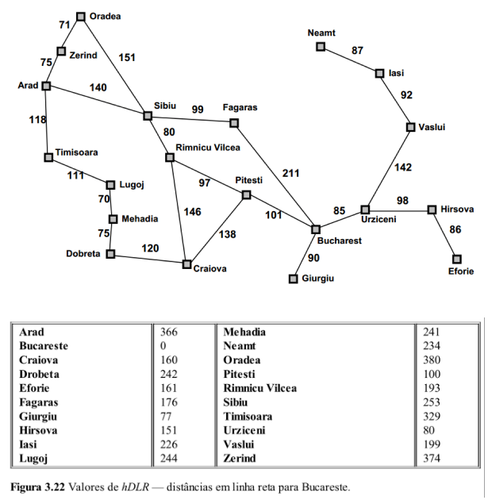

# a_star_assignment

Implementado a função `a_star` do arquivo [a_star.py](a_star.py) presente no repositório.

O arquivo [dists.py] (dists.py) contem uma representação das cidades e suas ligações contidas na imagem abaixo, com suas repectivas distancias entre elas. Outra informação contida neste arquivo é as heuristicas. Como as heuristicas são para a cidade Bucharest, ela é o unico destino viavel.

